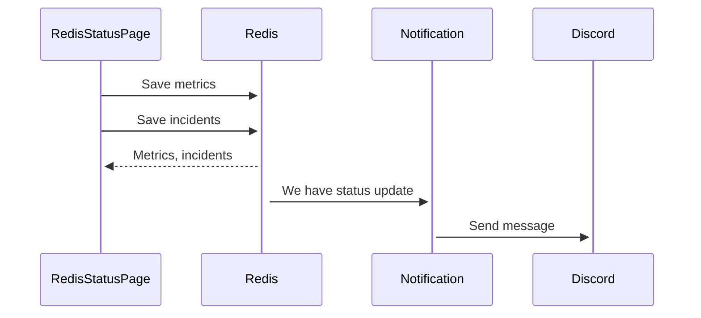

# RedisStatusPage

Status page for your next microservice backend apps!

This app started as an idea to integrate to my other project, [ritsu-pi](https://github.com/fahminlb33/ritsu-pi), it's a Raspberry Pi home server project where you can deploy all kind of apps to a single RPi (or even a cluster). Redis Hackathon comes in just the right moment to give me an extra motivation to finish this project :)

This project is basically a Status Page (like Github Status, Azure Status, Atlassian Statuspage, or something similar) built on top of Blazor Server and Redis. Here you can define a "health check" and get reports when one of your service is down. Also it has a Discord webhook client that will send you a message when one of your service status has changed.

- Monitor HTTP/TCP service uptime
- Simple latency graph over time
- Incident report when one of the services status has changed
- Discord webhook notification

<table>
  <tr>
    <td>
        
    </td>
    <td>
        
    </td>
    <td>
        
    </td>
   </tr> 
</table>

## How it works

Architecture diagram:



#### How the data is stored

We use Redis.OM to store service uptime and incident data, therefore most of the keys is auto generated.

- At startup, the app will save the date and time of the startup to measure the app uptime as string in `STATISTICS:FIRST_STARTUP`
- To make data retrieval easier, latest status of every service is stored as hash in `STATISTICS:LAST_STATUS`
- Service uptime is stored as json with key: `RedisStatusPage.Core.Services.MonitoringSnapshot:[ULID]`
  - `UnixTimestamp` = epoch in seconds
  - `ServiceName`
  - `Healthy`
  - `Latency` = in miliseconds
- Incident is stored as json with key: `RedisStatusPage.Core.Services.Incident:[ULID]`
  - `Id` = ULID generated from Redis.OM
  - `UnixTimestamp` = epoch in seconds
  - `LastStatus` = latest service status from `History` array
  - `ServiceName`
  - `History` = an array containg incident history
    - `UnixTimestamp`
    - `Status` = can be Reported/Resolved
    - `Message`

When the app is first started, it will set a new string key to store current date time

- `SET STATISTICS:LAST_STATUS "2022-08-22T15:38:06.0797433+07:00"`

For each service uptime status snapshot, a new json entry is created like:

- `JSON.SET RedisStatusPage.Core.Services.MonitoringSnapshot:01GB2BB10D634SGZAH5CFQJQ8Q $ '{"UnixTimestamp":1661157606,"ServiceName":"Prometheus","Healthy":true,"Latency":12}'`
- `HSET STATISTICS:LAST_STATUS Prometheus "1"`

For each service status change, we also record them as *incident* and publishes a message to notification service

- `JSON.SET RedisStatusPage.Core.Services.Incident:01GB2BSE22KHFX92Z3EE4HX1Q0 $ '{"Id":"01GB2BSE22KHFX92Z3EE4HX1Q0","UnixTimestamp":1661158076,"LastStatus":"Resolved","ServiceName":"Grafana","History":[{"UnixTimestamp":1661158076,"Status":"Reported","Message":"Service is DOWN"}]}'`
- `PUBLISH NOTIFICATION_CHAN '{"Timestamp":"2022-08-22T17:30:20+07:00","ServiceName":"Grafana","Status":"Reported"}'`

#### How the data is accessed

- To get services status on the home page, we retrieve the `STATISTICS:LAST_STATUS` hash
  - `HGETALL STATISTICS:LAST_STATUS`
- To get the service metrics on the statistics page, we get the same key as before but with additional processing
  - `HGETALL STATISTICS:LAST_STATUS`
  - Services = number of fields in the hash
  - Ready = number of values equals to "1" in the hash
  - Unreachable = number of values equals to "0" in the hash
  - Uptime = current time - first startup
- To get the chart data for latecy graph, we retrieve the keys using `FT.SEARCH`
  - `FT.SEARCH "monitoringsnapshot-idx" "(@UnixTimestamp:[(1661163811 inf])" LIMIT 0 100`
  - After we get all the data range, we need to aggregate them using LINQ
  - To get the the values for the X-axis (timestamp), we first grouped the data by `ServiceName`, then take the first group then project the `UnixTimestamp`
  - To get the all the values for the Y-axis (latency by service name), we first grouped the data by `ServiceName`, then return the aggregated `Latency` for each group to make chart series.
- To get the incident list, we can use the same `FT.SEARCH` as before
  - `FT.SEARCH "incident-idx" "*" LIMIT 0 10 SORTBY "UnixTimestamp" DESC`

Other Redis commands is used internally by the StackExchange.Redis or Redis.OM and might not be documented here.

#### How Discord notification is sent

The `RedisStatusPage` will publish a message to `NOTIFICATION_CHAN` and then `RedisStatusPage.Notification` will subscribe to it and it will execute the webhook request. This part is separated from the main app to decouple Discord (or maybe other service in the future) from main monitoring app and also to demonstrate how Redis Pubsub work.

## How to run it locally?

### Prerequisites

- Visual Studio 2022 Community - v17.3.0 (Web and Desktop Development workload)
- .NET - v6.0.400 (optional if you use Visual Studio 2022)
- Docker - v20.10.16 (optional)

### Local installation

Clone this repo, then `cd` to this repository root. Start a new instance of Redis Stack using the following command: `docker run -d -p 6379:6379 -p 8001:8001 redis/redis-stack`.

#### Configuration

Before using this app, you have to specify Redis server and what services to monitor.

Open the `RedisStatusPage/appsettings.json`, then edit the settings according to your system. Example config:

```json
{
  "RedisUri": "localhost:6379",
  "GraphLastSeconds": 900,
  "ScrapeInterval": 5,
  "Services": [
    {
      "ServiceName": "Prometheus",
      "TestMethod": "HTTP",
      "Host": "http://10.20.20.247:9090",
      "Port": 0
    },
    {
      "ServiceName": "Grafana",
      "TestMethod": "HTTP",
      "Host": "http://10.20.20.247:3000",
      "Port": 0
    }
  ]
}

```

- `RedisUri` is StackExchange.Redis connection parameters, consists of host:port pair separated by comma
- `GraphLastSeconds` is the number of seconds to visualize in the statistics dashboard
- `ScrapeInterval` periodically check the endpoints specified in `Services` every n seconds
- `Services` consists of an array containing all the services to monitor
- `Services.ServiceName` friendly name of the service
- `Services.TestMethod` can be HTTP or TCP
- `Services.Host` if test method is HTTP, you must specify an URL. If test method is TCP, you can specify hostname or IP address
- `Services.Port` if test method is HTTP, this field is ignored. If test method is TCP, this field is mandatory

The above config is my default sample config to detect for downtime for Prometheus and Grafana running on my Raspberry Pi cluster.

Note: if you want to use Redis Cloud, set the `RedisUri` to the appropiate host. Also, if you need authentication, you need to configure the connection settings in the `Program.cs` file.

#### For Visual Studio users,

Make sure you have updated the configuration!

Open the `RedisStatusPage.sln`, then run `RedisStatusPage` project. Visit https://localhost:7128 to access the status page.

If you want to use the Discord notification, you also need to run the `RedisStatusPage.Notification`. 

#### From terminal,

Before running anything, edit the `docker-compose.yml` to set the `REDIS_URI` and `DISCORD_WEBHOOK_URI`. You can get the webhook URI by going to a Discord channel > Settings > Integration > Webhook > Create Webhook > Copy Webhook URL.

Note that the above step is optional, if you don't need the Discord notification bot, delete the `notification` key from `docker-compose.yml`

`cd` to this project root, then run `docker-compose up`. It will spin up all the necessary containers and you're ready to go. Visit https://localhost:7128 to access the status page.
